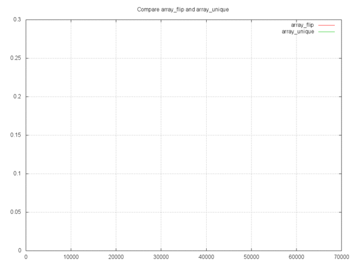

# PHPench



PHPench creates a graphical output for a PHP benchmark.
Plot the runtime of any function in realtime with GnuPlot and create an image
out of the result.

[](https://travis-ci.org/mre/PHPench)

## Why is it useful?

#### Algorithms are beautiful

Sometimes the difference between two algorithms is hard to explain but easy to show.  
For instance, take two sorting algorithms which both have a best-case
runtime of `O(n*log n)`. Depending on the input, one can be much faster than the
other. This tools helps you see what's going on.

#### Death to premature-optimizations

Whenever people tell you that using single quotes instead of double quotes
around strings is a performance improvement, it's time to debunk some myths.
Most of the time such programmer folklore turns out to be misguided and can actually be pretty harmful.  
*"Premature emphasis on efficiency is a big mistake which may well be the source
of most programming complexity and grief."* (Donald Knuth)  
Let's be professionals. Let's measure.

## Example

Using PHPench feels a bit like writing a visual unit test. Check it out:  

```PHP
<?php

require_once __DIR__.'/../vendor/autoload.php';

/*
 * You can use an closure or a class that implements TestInterface.
 *
 * Data that will be processed by the tested function can be executed
 * without including its execution time. This will provide more accurate data.
 */

abstract class AbstractBenchmark implements \mre\PHPench\BenchmarkInterface
{
    protected $test;

    function setUp($arrSize)
    {
        $this->test = array();
        for ($i=1; $i<$arrSize; $i++) {
            $this->test[$i]= $arrSize % $i;
        }

        return $this->test;
    }
}

class BenchmarkArrayFlip extends AbstractBenchmark
{
    public function execute() {
        $test = array_flip(array_flip($this->test));
    }
}

class BenchmarkArrayUnique extends AbstractBenchmark
{
    public function execute() {
        $test = array_unique($this->test);
    }
}

// Create a new benchmark instance
$phpench = new \mre\PHPench(new \mre\PHPench\Aggregator\MedianAggregator);

// Use GnuPlot for output
$oOutput = new \mre\PHPench\Output\GnuPlotOutput('test2.png', 1024, 768);

// Alternatively, print the values to the terminal
//$oOutput = new \mre\PHPench\Output\CliOutput();

$oOutput->setTitle('Compare array_flip and array_unique');
$phpench->setOutput($oOutput);

// Add your test to the instance
$phpench->addBenchmark(new BenchmarkArrayFlip, 'array_flip');
$phpench->addBenchmark(new BenchmarkArrayUnique, 'array_unique');

// Run the benchmark and plot the results in realtime.
// With the second parameter you can specify
// the start, end and step for each call
$phpench->setInput(range(1,pow(2,16), 1024));
$phpench->setRepetitions(4);
$phpench->run();
```

## Installation

1.) Add this package to your composer.json

```
{
    "require": {
      "mre/phpench": "*@dev"
    }
}
```

2.) Install gnuplot

For *Mac OS X* you can install gnuplot via homebrew. For live generated charts you also need to install XQuartz.
```
Without X11 support:
$ brew install gnuplot

With X11 supprt (recommended!):
$ brew install gnuplot --with-x
```

For *Linux* use your package manager.
```
apt-get install gnuplot
```

3.) Look at the examples for usage

## Maintainers

Matthias Endler (@matthiasendler)  
Markus Poerschke (@markuspoerschke)

## License

Apache License Version 2.0
